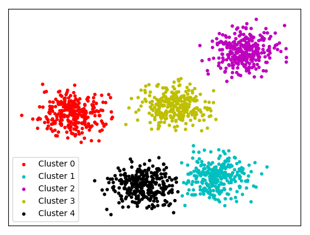

# Introduction

Data clustering is the assignment of objects to homogeneous groups (called clusters) while making sure that objects in different groups are not similar. Clustering is considered an unsupervised task as it aims to describe the hidden structure of the objects. Each object is described by a set of characters called features. The first step of dividing objects into clusters is to define the distance between the different objects. Defining an adequate distance measure is crucial for the success of the clustering process.

In the field of machine learning, it is useful to apply a process called dimensionality reduction to highly dimensional data. The purpose of this process is to reduce the number of features under consideration, where each feature is a dimension that partly represents the objects.

Dimensionality reduction can be executed using two different methods:\
- Selecting from the existing features (feature selection)\
- Extracting new features by combining the existing features (feature extraction)\


In this paper, Opel Corsa dataset is used to analysis and it is thought to be work both in different data clustering and dimentionality reduction approaches will give more insight about how to use these approaches together in daily analysis. Analysis divided into three main parts.

__1. Exploratory Data analysis__\
  -  Statistical Analysis, Visualization, Data Transformation\
__2. Dimensonality Reduction__\
  - Drop no variance features \
  - Correlation analysis to check similarity between features\
  - PCA(Principal Component Analysis) for dimentionality reduction + Feature Engineering\
__3. Clustering__\
  - K-Means\
  - PAM\
  - Hierarchical Clustering\

# Exploratory Data analysis

In this part, you can observe statistical analysis of the given data for analysis with some visualization parts to give an insight about distribution of the data.

> For data transformation, chr type features converted into factor and inputed with some numeric value which categorize this features.

## Loading Packages
```{r message=FALSE, class.source="fold-show", r,warning=FALSE}
packages<-function(x){
  x<-as.character(match.call()[[2]])
  if (!require(x,character.only=TRUE)){
    install.packages(pkgs=x,repos="http://cran.r-project.org")
    require(x,character.only=TRUE)
  }
}

packages(tidyverse)
packages(dplyr)
packages(ggplot2)
packages(broom)
packages(rpart)
packages(rpart.plot) 
packages(rattle)
packages(cowplot)
packages(knitr)
packages(corrplot)
packages(gridExtra)
packages(GGally)
packages(cluster) # clustering algorithms 
packages(factoextra) # clustering algorithms & visualization
packages(funModeling) 
packages(Hmisc)
packages(FactoMineR)
packages(factoextra)
packages(plot3D)
```

## Statistical Analysis of Data {.tabset}
```{r, class.source="fold-show"}
cars <- read.csv('C:/Users/ALPARSLAN/Desktop/Alparslan/MERVE/irem&Onur/Project 2/Data_3000.csv', sep=";", dec=".", header=TRUE)
```

### Cars.head()
```{r, class.source="fold-show"}
kable(head(cars))
```

### str(cars)
```{r, class.source="fold-show"}
kable(str(cars))
```

> You can observe that we have character type features. To make an easier analysis, I factorized this features.

### After-Factor str(cars)
```{r, class.source="fold-show"}
cars[sapply(cars, is.character)] <- lapply(cars[sapply(cars, is.character)],as.factor)
kable(str(cars))
```

### Status
```{r, class.source="fold-show"}
status(cars)
```

### Freq
```{r, class.source="fold-show"}
freq(cars)
```

### Plot_num
```{r, class.source="fold-show"}
plot_num(cars)
```

### Profiling_num
```{r, class.source="fold-show"}
profiling_num(cars)
```

### Describe
```{r, class.source="fold-show"}
describe(cars)
```

## Data Visualization of Data {.tabset}

### Factor Hist
```{r, class.source="fold-show"}
cars %>% dplyr::select(where(is.factor)) %>%
  gather(attributes, value, 1:6) %>%
  ggplot(aes(x = value)) +
  geom_bar(fill = 'lightblue2', color = 'black') +
  facet_wrap(~attributes, scales = 'free_x') +
  labs(x="Values", y="Frequency") +
  theme_bw()
```

> From the `brand` and `model` feature plots, we can easily observe that these features have zero variance, so we can simply drop these columns in dimentionality reduction section.\
`Fuel_Type`, `Gear_type` and `WD` seems to be categorical features!

### Numeric Hist
```{r, class.source="fold-show"}
cars %>% dplyr::select(where(is.numeric)) %>%
  gather(attributes, value, 1:5) %>%
  ggplot(aes(x = value)) +
  geom_histogram(fill = 'lightblue2', color = 'black') +
  facet_wrap(~attributes, scales = 'free_x') +
  labs(x="Values", y="Frequency") +
  theme_bw()

cars$Engine <- as.factor(cars$Engine)
```

> `Engine` is a numeric column but it has only 7 unique value. So we can consider this feature as categorical one also.

### Upper Correlation Matrix
```{r, class.source="fold-show"}
corrplot(cor(cars %>% dplyr::select(where(is.numeric))), type = 'upper', method = 'number', tl.cex = 0.9)
```

> There is a high correlation between `Price & Year` and `Enigne & Engine_Capacity` columns.
We drop some highly corelated column to use dimentionality reduction method.

### Price-Year Relation
```{r, class.source="fold-show"}
ggplot(cars, aes(x = Price, y = Year)) +
  geom_point() +
  geom_smooth(method = 'lm', se = FALSE) +
  theme_bw()
```

> You can easily observe that, there is an outlier in the data... Let's treat this outlier with filtering.

```{r, class.source="fold-show"}
cars[cars$Price > 100000, ]$Price = median(cars$Price)
```

Let's check it again

### Price-Year Relation After Outlier
```{r, class.source="fold-show"}
ggplot(cars, aes(x = Price, y = Year)) +
  geom_point() +
  geom_smooth(method = 'lm', se = FALSE) +
  theme_bw()
```

Now it seems better :)

### Fuel-Type & Price Box Plot + Scatter Plot
```{r, class.source="fold-show"}
ggplot(data = cars, aes(x=Fuel_Type, y=Price, color=Fuel_Type)) + 
  geom_boxplot()+
  scale_color_brewer(palette="Dark2") + 
  geom_jitter(shape=16, position=position_jitter(0.2))+
  labs(title = 'Title',
       y='Price',x='Fuel_Type')
```

> In this plot, we can observe that, `Gasoline type` cars are expensive then the rest.

### Year & Price, Fuel-TypeBox Plot + Gear-Type Scatter Plot
```{r, class.source="fold-show"}
ggplot(data = cars, aes(x=Fuel_Type,y=Price, fill=Fuel_Type)) + 
  geom_boxplot()+
  scale_fill_brewer(palette="Green") + 
  geom_jitter(shape=16, position=position_jitter(0.2))+
  labs(title = 'Title',
       y='Price',x='Year')+
  facet_wrap(~Gear_Type,nrow = 1)
```

> In this plot, we can observe that, `automatic` and `semi-automatic` cars are more expensive than `manual` type cars while `gasoline` cars still most expensive ones respect to fuel_type.

### Year & Price, Fuel-TypeBox Plot + Year Scatter Plot
```{r, class.source="fold-show"}
ggplot(data = cars, aes(x=Fuel_Type,y=Price, fill=Fuel_Type)) + 
  geom_boxplot()+
  scale_fill_brewer(palette="Green") + 
  geom_jitter(shape=16, position=position_jitter(0.2))+
  labs(title = 'Title',
       y='Price',x='Year')+
  facet_wrap(~Year,nrow = 1)
```

> In this plot, we can observe that, `Year` and `price` have high positive correlation between each other.


> Create 3D plot to visualize most informative features `Price & Year & KM` 

```{r, class.source="fold-show"}
# x, y, z variables
x <- cars$Price
y <- cars$Km
z <- cars$Engine_Capacity 

scatter3D(cars$Price, cars$Km,cars$Year,
          xlab = "Price", ylab = "Km", zlab = "Year",
          phi = 0, bty = "g",pch = 20,cex = 2,
          ticktype = "detailed", colvar=as.numeric(cars$Year))
```

## Categorical Value Treatment & Data Normalization
Give index number to factor columns...

```{r, class.source="fold-show"}
car <- cars
indx <- sapply(car, is.factor)
car[indx] <- lapply(car[indx], function(x) as.numeric(factor(x)))
```

> To run the algorithms below, we need to use numerical values. These features are factor and simply given them some number to identify this factor values.

```{r, class.source="fold-show"}
kable(str(car))
kable(head(car))
```

# Dimentionality Reduction
In the field of machine learning, it is useful to apply a process called dimensionality reduction to highly dimensional data. The purpose of this process is to reduce the number of features under consideration, where each feature is a dimension that partly represents the objects.
Why is dimensionality reduction important? As more features are added, the data becomes very sparse and analysis suffers from the curse of dimensionality. Additionally, it is easier to process smaller data sets.
Dimensionality reduction can be executed using two different methods:\
- Selecting from the existing features (feature selection)\
- Extracting new features by combining the existing features (feature extraction)\

## Zero-Variance Analysis
```{r, class.source="fold-show"}
kable(profiling_num(car))
```

> There are two columns that have zero variance -> `Brand`, `Model`. \
Drop these zero variance columns for dimension reduction.

```{r, class.source="fold-show"}
drops <- c("Brand","Model")
car <- car[ , !(names(car) %in% drops)]
kable(head(car))
```

## Correlation Analysis
```{r, class.source="fold-show"}
corrplot(cor(car[sapply(car, is.numeric)]), type = 'upper', method = 'number', tl.cex = 0.9)
```

> From correlation analysis, there is a high correlation between Price and Year which is expected also Engine and Engine Capacity. \
We can reduce dimentionality by using highly correlated features because if two features are highly correlated, then they have same effect from similar span in space to the machine learning model. \
Candidates for dimentionality reduction are: `Price&Year` and  `Engine&Engine_Capacity`. Let's remove `Engine` and `Year` features from the data.

```{r, class.source="fold-show"}
car <- car[!names(car) %in% c("Engine","Year")]
kable(head(car))
```

## PCA(Principal Component Analysis) {.tabset}
In this chapter we are going to use PCA for dimentionality reduction.\
The main technique for feature extraction is the Principle Component Analysis (PCA). PCA guarantees finding the best linear transformation that reduces the number of dimensions with a minimum loss of information. Sometimes the information that was lost is regarded as noise – information that does not represent the phenomena we are trying to model, but is rather a side effect of some usually unknown processes. PCA process can be visualized as follows:\


### Basic PCA
```{r, class.source="fold-show"}
res.pca <- PCA(car)
```

> In the PCA graph above, we can observe that ``Engine_Capacity``, ``Km`` and ``Price`` are the best features to cover whole distribution.

### Extract Eigenvalue / Variance
Let's find eigenvalue / variance of the data and show percentage of each feature.
```{r, class.source="fold-show"}
get_eig(res.pca)
fviz_screeplot(res.pca, addlabels = TRUE, ylim = c(0, 50))
```

> Result: We can cover ~95% of all data with 8 dimension rather that 10.

__Extract the results for variables__\
Now let's merge these eigenvalue results with feature names and see which features are more important than the others.
```{r, class.source="fold-show"}
var <- get_pca_var(res.pca)
# Coordinates of variables
kable(var$coord)
# Contribution of variables
kable(var$contrib)
# Control variable colors using their contributions
fviz_pca_var(res.pca, col.var="contrib",
             gradient.cols = c("#00AFBB", "#E7B800", "#FC4E07"),
             repel = TRUE # Avoid text overlapping
)
# Contributions of variables to PC1
fviz_contrib(res.pca, choice = "var", axes = 1, top = 10)
# Contributions of variables to PC2
fviz_contrib(res.pca, choice = "var", axes = 2, top = 10)
```

__Extract the results for individuals__\
Let's find results for individuals.
```{r, class.source="fold-show"}
ind <- get_pca_ind(res.pca)
# Coordinates of individuals
kable(head(ind$coord))
# Contribution of variables
kable(head(ind$contrib))

var<-get_pca_var(res.pca)
a<-fviz_contrib(res.pca, "var", axes=1, xtickslab.rt=90) # default angle=45°
b<-fviz_contrib(res.pca, "var", axes=2, xtickslab.rt=90)
grid.arrange(a,b,top='Contribution to the first two Principal Components')
```

__RESULT FOR PCA__\

> As a result from the contributions graphs above, both in results for variables and results for individual case, we can simply drop ``WD``, ``Color`` and ``Seller`` features from the dataset. Since we improve our data complexity, we won't loose much accuracy with clustering the data which is a desired case for dimentionality reduction.

```{r, class.source="fold-show"}
car <- car[!names(car) %in% c("WD", "Color","Seller")]
kable(head(car))
```


# Clustering {.tabset}
In this chapter we are going to use K-Means, PAM and Hierarchical clustering methods.\
Clustering is the task of dividing the population or data points into a number of groups such that data points in the same groups are more similar to other data points in the same group than those in other groups. In simple words, the aim is to segregate groups with similar traits and assign them into clusters.\

## K-MEANS
There are many clustering algorithms, each has its advantages and disadvantages. A popular algorithm for clustering is k-means, which aims to identify the best k cluster centers in an iterative manner. Cluster centers are served as “representative” of the objects associated with the cluster. k-means’ key features are also its drawbacks:\
- The number of clusters (k) must be given explicitly. In some cases, the number of different groups is unknown.\
- k-means iterative nature might lead to an incorrect result due to convergence to a local minimum.\
- The clusters are assumed to be spherical.\
Despite these drawbacks, k-means remains the right and popular choice in many cases. An example for clustering using k-means on spherical data can be seen in Figure.\


### K-Means With Different Center Points
Let's compare k-means with `k = [2,3,4,5]`
```{r, class.source="fold-show"}
set.seed(123)
cars_K2 <- kmeans(car, centers = 2, nstart = 25)
cars_K3 <- kmeans(car, centers = 3, nstart = 25)
cars_K4 <- kmeans(car, centers = 4, nstart = 25)
cars_K5 <- kmeans(car, centers = 5, nstart = 25)
p1 <- fviz_cluster(cars_K2, geom = "point", data = car) + ggtitle(" K = 2")
p2 <- fviz_cluster(cars_K3, geom = "point", data = car) + ggtitle(" K = 3")
p3 <- fviz_cluster(cars_K4, geom = "point", data = car) + ggtitle(" K = 4")
p4 <- fviz_cluster(cars_K5, geom = "point", data = car) + ggtitle(" K = 5")
grid.arrange(p1, p2, p3, p4, nrow = 2)
```

### Find Optimal Number of Clusters K
Let's compare number of clusters with ``Silhouette`` and ``Elbow`` Graphs
```{r, class.source="fold-show"}
f1 <- fviz_nbclust(car, FUNcluster = kmeans, method = "silhouette") + 
  ggtitle("Optimal number of clusters \n K-means")
f2 <- fviz_nbclust(car, FUNcluster = kmeans, method = "wss") + 
  ggtitle("Optimal number of clusters \n K-means")
grid.arrange(f1, f2, ncol=2)
```

> From `Silhouette` and `Elbow` graphs, we can observe that there are 2 candidate for number of clusters as `2` or `3`. Let's deep dive into the number of clusters with 2 and 3. 

### K-Means With 2 and 3 Number of Clusters
Let's compare k-means with number of clusters `2` and `3`.
```{r, class.source="fold-show"}
km2 <- eclust(car, k=2, FUNcluster="kmeans", hc_metric="euclidean", graph=F)
c2 <- fviz_cluster(km2, data=car, elipse.type="convex", geom=c("point")) + ggtitle("K-means with 3 clusters")
s2 <- fviz_silhouette(km2)
grid.arrange(c2, s2, ncol=2)

km3 <- eclust(car, k=3, FUNcluster="kmeans", hc_metric="euclidean", graph=F)
c3 <- fviz_cluster(km3, data=car, elipse.type="convex", geom=c("point")) + ggtitle("K-means with 3 clusters")
s3 <- fviz_silhouette(km3)
grid.arrange(c3, s3, ncol=2)
```

> We can conclude the optimal number of cluster for k-means is `3`.\
Let's check results for other methods --> `PAM`, `HIERARCHICAL CLUSTERING`

## PAM
The PAM algorithm is based on the search for k representative objects or medoids among the observations of the data set.

After finding a set of k medoids, clusters are constructed by assigning each observation to the nearest medoid.
Next, each selected medoid m and each non-medoid data point are swapped and the objective function is computed. The objective function corresponds to the sum of the dissimilarities of all objects to their nearest medoid.

The SWAP step attempts to improve the quality of the clustering by exchanging selected objects (medoids) and non-selected objects. If the objective function can be reduced by interchanging a selected object with an unselected object, then the swap is carried out. This is continued until the objective function can no longer be decreased. The goal is to find k representative objects which minimize the sum of the dissimilarities of the observations to their closest representative object.


### PAM With 2 and 3 Number of Clusters
Let's compare PAM with number of clusters `2` and `3`.
```{r, class.source="fold-show"}
pam2 <- eclust(car, k=2 , FUNcluster="pam", hc_metric="euclidean", graph=F)
cp2 <- fviz_cluster(pam2, data=car, elipse.type="convex", geom=c("point")) + ggtitle("PAM with 2 clusters")
sp2 <- fviz_silhouette(pam2)
grid.arrange(cp2, sp2, ncol=2)

pam3 <- eclust(car, k=3 , FUNcluster="pam", hc_metric="euclidean", graph=F)
cp3 <- fviz_cluster(pam3, data=car, elipse.type="convex", geom=c("point")) + ggtitle("PAM with 3 clusters")
sp3 <- fviz_silhouette(pam3)
grid.arrange(cp3, sp3, ncol=2)
```

> We can conclude the optimal number of cluster for PAM is `3` which is the same conclusion with k-means.\
Let's check results for other methods --> `HIERARCHICAL CLUSTERING`


## HIERARCHICAL CLUSTERING 
### Hierarchical Clustering {.tabset}

Hierarchical clustering is where you build a cluster tree (a dendrogram) to represent data, where each group (or “node”) links to two or more successor groups. The groups are nested and organized as a tree, which ideally ends up as a meaningful classification scheme. Distances between center points are calculate for each data point by using different type of distance calculation method and creating a distance matrix.

Each node in the cluster tree contains a group of similar data; Nodes group on the graph next to other, similar nodes. Clusters at one level join with clusters in the next level up, using a degree of similarity; The process carries on until all nodes are in the tree, which gives a visual snapshot of the data contained in the whole set. The total number of clusters is not predetermined before you start the tree creation.

__What is Dendongram?__\


#### HIERARCHICAL CLUSTERING with Euclidean Distance
Let's compare number of clusters of `2` and `3` with `euclidean distance` in hierarchical clustering.
```{r, class.source="fold-show"}
discar<- dist(car, method = "euclidean")
hcar<-hclust(discar, method="ward.D2")
plot(hcar)
groups <- cutree(hcar, k=2) 
rect.hclust(hcar, k=2, border="red") 

discar<- dist(car, method = "euclidean")
hcar<-hclust(discar, method="ward.D2")
plot(hcar)
groups <- cutree(hcar, k=3)
rect.hclust(hcar, k=3, border="red") 
```

#### HIERARCHICAL CLUSTERING with Manhattan Distance
Let's compare number of clusters of `2` and `3` with `manhattan distance` in hierarchical clustering.
```{r, class.source="fold-show"}
d <- dist(car, method = "manhattan")
H.fit <- hclust(d, method="ward.D2")
plot(H.fit) 
groups <- cutree(H.fit, k=2) 
rect.hclust(H.fit, k=2, border="red") 

d <- dist(car, method = "manhattan") 
H.fit <- hclust(d, method="ward.D2")
plot(H.fit)
groups <- cutree(H.fit, k=3)
rect.hclust(H.fit, k=3, border="red") 
```

## BEST CLUSTER
> __RESULT :__ As you can observe from the clustering methods and finding an optimal number of cluster processes, it is concluded to use...\
- __`Number of Cluster`:__ 3\
- __`Clustering Method`:__ K-Means Clustering\
- __`Distance Calculation Method`:__ Euclidean and Manhattan can bu used

```{r, class.source="fold-show"}
set.seed(123)
final <- kmeans(car, centers = 3, nstart = 25)
print(final$centers)
```

__FINAL PLOT FOR K-MEANS CLUSTER NUMBER `3`__
```{r, class.source="fold-show"}
f1 <- fviz_cluster(final, car)
f2 <- fviz_silhouette(silhouette(final$cluster,discar))
grid.arrange(f1, f2, ncol=2)
```

__PLOT FOR EACH FEATURE WITH CLUSTER__
```{r, class.source="fold-show"}
plot(car,col=final$cluster)
```

__PLOT FOR `PRICE` & `KM` WITH CLUSTER__
```{r, class.source="fold-show"}
hcar.a<- hclust(discar,method = "average")
hcaralabel<- cutree(hcar.a,3)
hcar.labels<- cutree(hcar,3)

car<- data.frame(car)
ggplot(car,aes(car$Price,car$Km))+geom_point(aes(col=hcar.labels),show.legend = F)+
  scale_color_gradient(low="blue", high="red")##change the colour by the scale
```


# References

- https://bookdown.org/yihui/rmarkdown/
- https://www.imperva.com/blog/clustering-and-dimensionality-reduction-understanding-the-magic-behind-machine-learning/
- https://www.statisticshowto.com/hierarchical-clustering/
- https://rpubs.com/Przemyslaw_Mazurek/579984
- https://rpubs.com/abdul_yunus/Kmeans_Clustering
- https://rpubs.com/Szmariu/distance-metrics-performance
- https://meigarom.github.io/blog/pca.html
